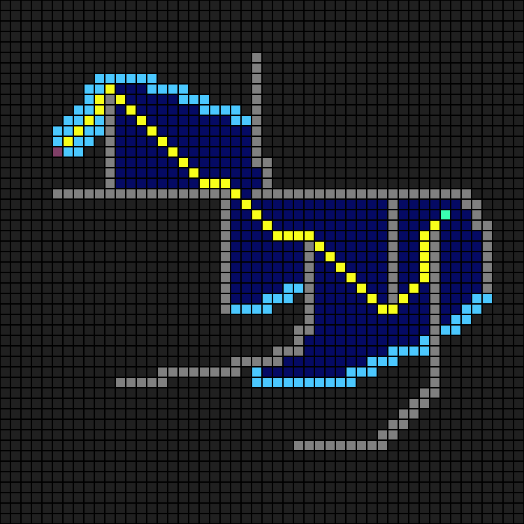

# 算法框架

## 机器人路线规划算法

### A* 算法

https://zh.wikipedia.org/wiki/A*%E6%90%9C%E5%B0%8B%E6%BC%94%E7%AE%97%E6%B3%95

### Jump Point Search

在计算机科学中，跳点搜索（JPS）是对A\*搜索算法的优化，适用于均匀成本网格。它通过图修剪减少搜索过程中的对称性，根据可以对当前节点的邻居做出的假设，在满足与网格相关的某些条件的情况下，消除网格中的某些节点。因此，该算法可以考虑沿着网格中直线（水平、垂直和对角线）进行长距离的“跳跃”，而不是普通A\*考虑的从一个网格位置到下一个网格位置的小步骤。

跳点搜索保留了A*的最优性，同时可能将其运行时间缩短一个数量级。

---

算法 Demo

---

## 程序整体框架

分为多线程，第一线程进行第 0-6 个机器人的路径规划，第二个线程进行第 7-9 个机器人的路径规划，以及每帧的机器人碰撞检测（机器人距离小于 3 时才检测，否则不检测，节省算力）。

船的停靠位置：根据货物的分布密度来初始化。

需要在结构体中新增变量，存储机器人和货物的存储关系，避免重复分配；并且存储货物剩余存在时间，防止机器人跑到一半货物消失。

*进阶挑战：在程序初始化阶段，就计算出地图上任意两点之间的最短路径，并存储进表格，以供后续程序运行时查表，从而极大缩小后续的计算时间。*