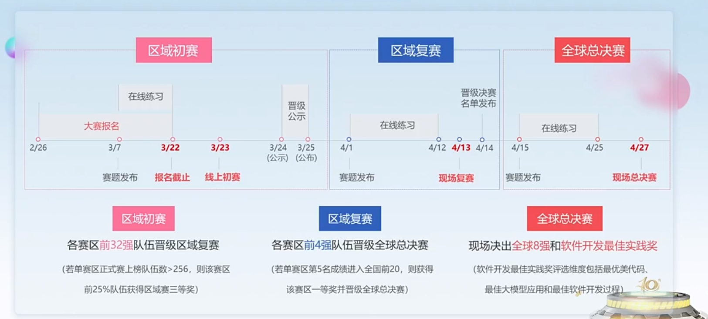
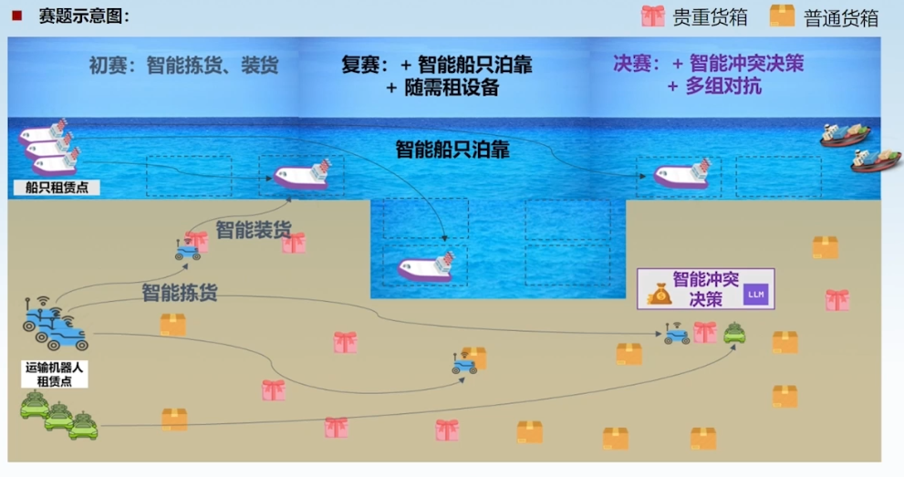

# 华为软件精英挑战赛 空中宣讲会

- 记录时间：2024/3/7
- 记录者：Kevin

---

比赛日程：

允许多次提交，取最好成绩，**做好版本管理**。

## 赛题特点

1. 多队同场次对抗（对抗性）
2. 可视化大屏对战（观赏性）
3. 引入大模型 Agent 技术开发（大模型服务由赛事平台提供）
4. 可使用大模型技术辅助开发（如：GPT）

## 赛题解读

- 在花钱和赚钱之间进行 trade off
- 对 LLM 模型做提示词工程

## 思路

对地图进行划分，机器人在局部进行货物搜索，同时可以避免碰撞。
机器人搬货的同时可以移动船只更换泊位，达成最小的机器人移动距离。
机器人距离较远时，可以不计算冲突情况，节省算力资源。